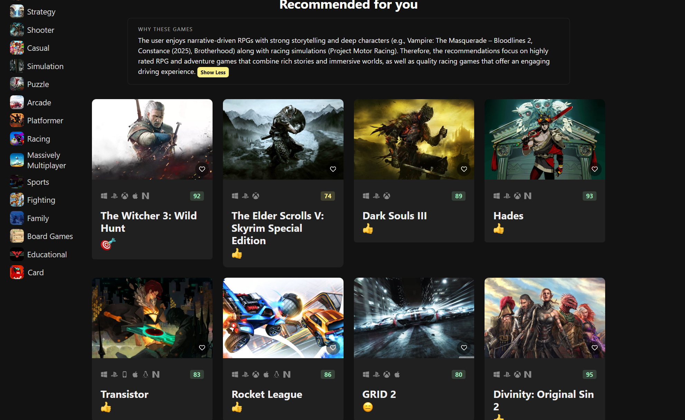
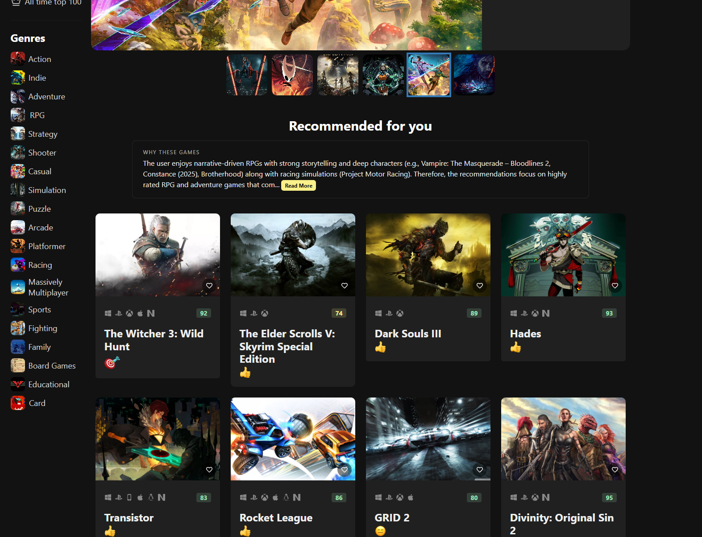

# About

This is the GameHub Project repository, a robust and responsive website equipped with advanced search capabilities and dynamic filtering options for a wide range of video games to cater to every gamer's needs. Dive into the detailed game page for game description, trailers, and screenshots.

This project now also includes an **LLM-powered recommendation feature**.  
Users can select favorite games, and the backend (a Firebase Cloud Functions service using GPT-4.1-mini) generates:

- A curated list of recommended games  
- A global summary explaining why these games match the user's taste  
- Individual reasoning for each recommended title  

All recommendations are strictly chosen from a curated RAWG dataset and validated with JSON schema to prevent hallucinated or invalid results.

> **Note:**  
> The recommendation feature is currently restricted to my developer account only for traffic protection.  
> Please refer to the screenshots below for how the feature works.

This project is based on Vite and utilizes Chakra UI for styling, Zustand for state management, Axios for communication to the backend, Vercel for deployment, etc.

You can find the working project at:  
https://game-hub-mauve-pi.vercel.app/

The backend repository (access restricted to my GitHub account only) is located at:  
https://github.com/yzhou677/gamehub-backend

## Screenshots

## Getting Started

To get started, follow these steps:

1. Clone this repository to your local machine.  
2. Run `npm install` to install the required dependencies.  
3. Get a RAWG API key at https://rawg.io/apidocs. You'll have to create an account first.  
4. Add the API key to **src/services/api-client.ts**  
5. Run `npm run dev` to start the web server.
